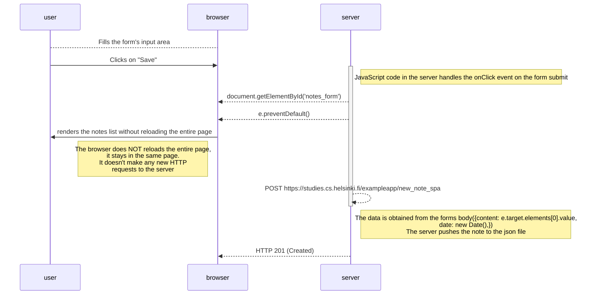

# FullStack Open 2024

## Excercise 0.6

```mermaid

sequenceDiagram
    participant user
    participant browser
    participant server

    user -->browser: Fills the form's input area
    user ->>browser: Clicks on "Save"

    activate server

    Note right of server: JavaScript code in the server handles the onClick event on the form submit

    server -->> browser: document.getElementById('notes_form')
    server -->> browser: e.preventDefault()

    browser ->> user: renders the notes list without reloading the entire page

    Note left of browser: The browser does NOT reloads the entire page, <br/>it stays in the same page. <br/>It doesn't make any new HTTP <br/>requests to the server


    server-->>server: POST https://studies.cs.helsinki.fi/exampleapp/new_note_spa
    deactivate server

    Note right of server: The data is obtained from the forms body({content: e.target.elements[0].value,<br />date: new Date(),}) <br />The server pushes the note to the json file


    server -->> browser: HTTP 201 (Created)
```
