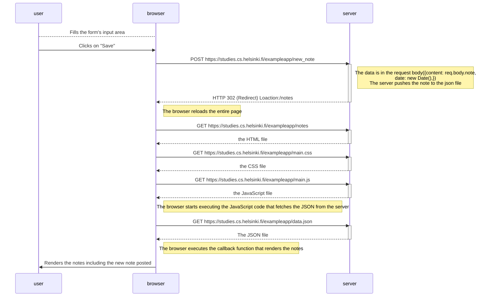

# FullStack Open 2024

## Excercise 0.4

```mermaid

sequenceDiagram
    participant user
    participant browser
    participant server

    user -->browser: Fills the form's input area
    user ->>browser: Clicks on "Save"

    browser->>server: POST https://studies.cs.helsinki.fi/exampleapp/new_note
    activate server
    Note right of server: The data is in the request body({content: req.body.note,<br />date: new Date(),}) <br />The server pushes the note to the json file
    server-->>browser: HTTP 302 (Redirect) Loaction:/notes
    deactivate server


    Note right of browser: The browser reloads the entire page

    browser->>server: GET https://studies.cs.helsinki.fi/exampleapp/notes
    activate server
    server-->>browser: the HTML file
    deactivate server


    browser->>server: GET https://studies.cs.helsinki.fi/exampleapp/main.css
    activate server
    server-->>browser: the CSS file
    deactivate server

    browser->>server: GET https://studies.cs.helsinki.fi/exampleapp/main.js
    activate server
    server-->>browser: the JavaScript file
    deactivate server

    Note right of browser: The browser starts executing the JavaScript code that fetches the JSON from the server

    browser->>server: GET https://studies.cs.helsinki.fi/exampleapp/data.json
    activate server
    server-->>browser: The JSON file
    deactivate server

    Note right of browser: The browser executes the callback function that renders the notes

    browser ->> user: Renders the notes including the new note posted
```
